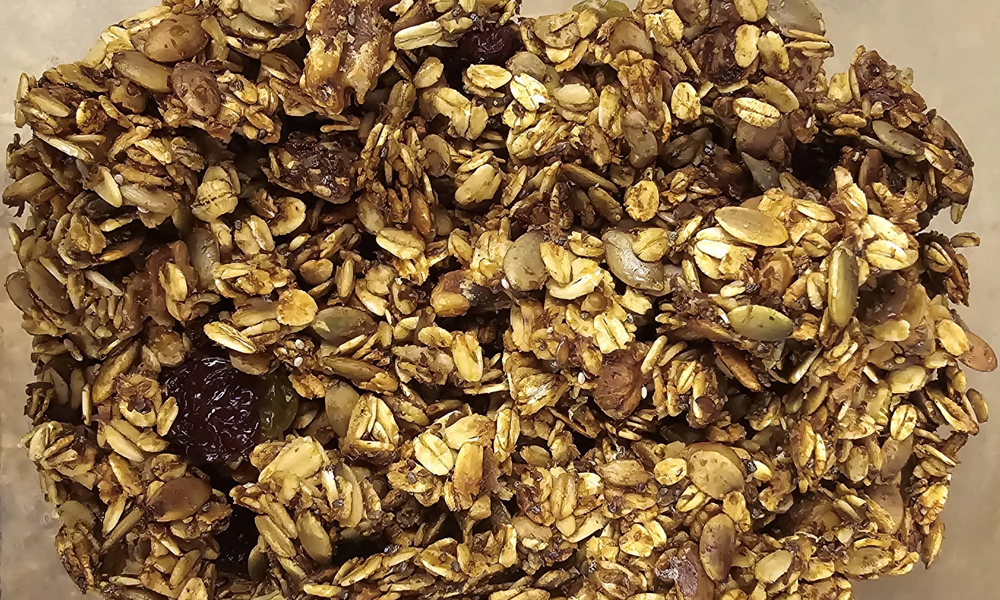

+++
title = 'How the recipe shortcodes work'
date = 2024-04-29T13:44:16-07:00
description = 'Use recipe schema shortcodes to publish SEO-friendly recipe pages with schema.org JSON-LD structured data.'
categories = ['recipes']
tags = [
  "healthy",
  "vegetarian",
  "breakfast",
  "baked",
  "meal-prep"
]
homeFeature = true
homeFeatureIcon = "fa-solid fa-bowl-food"
[menu]
 [menu.main]
  weight = 150
  parent = 'docs'
featured_image = "granola_fini_lemon_chia_seed.webp"

recipe = true
recipeCuisine = "Breakfast"
prepTime = "PT10M"
cookTime = "PT50M"
totalTime = "PT1H"
recipeYield = "3 Cups"
calories = 70
recipeIngredients = [
  "2 C. oats",
  "1 C. mixed pepitas, sunflower seeds, and crushed walnuts",
  "3 tablespoons olive oil",
  "1/4 cup honey",
  "1/2 teaspoon ground cinnamon",
  "1/2 teaspoon salt",
  "1 tablespoon chia seeds",
  "1 tablespoon lemon juice",
  "Zest from 2 lemons",
  "1 C. dried golden raisins and dried cherries"
]

[[recipeInstructions]]
  name = "mix"
  text = "Mix all ingredients in a bowl, ensuring oats and seeds are fully coated in the liquid. Add zest from 1 lemon now."
[[recipeInstructions]]
  name = "spread"
  text = "Spread evenly over a large baking pan lined with parchment paper."
[[recipeInstructions]]
  name = "bake"
  text = "Bake at 290°F for 50 minutes. Do not stir."
[[recipeInstructions]]
  name = "press"
  text = "Remove from oven, scatter dried fruit on top, then cover with another sheet of parchment and a second pan to press down for clumpier granola."
[[recipeInstructions]]
  name = "zest"
  text = "Add zest from the second lemon."
[[recipeInstructions]]
  name = "cool"
  text = "Let cool completely in the pan, then break apart into clumps."
+++

## Overview

The ingredient and step data lives entirely in front matter. The shortcodes read it and render it — no repeated data in the body. This keeps your content clean and makes the structured data for search engines automatic.

If your site uses recipes, this approach means you write data once and it appears in both the rendered page and the JSON-LD schema block in the `<head>`.

<!-- more -->

**Front matter structure:**

```toml
recipe = true
recipeCuisine = "Breakfast"
prepTime = "PT10M"      # ISO 8601 duration
cookTime = "PT50M"
totalTime = "PT1H"
recipeYield = "3 Cups"
calories = 70

recipeIngredients = [
  "2 C. oats",
  "1/4 cup honey",
  # prefix a line with ** to render it as a subheading
  "**Dry goods",
]

[[recipeInstructions]]
  name = "mix"      # used as the anchor ID and step label
  text = "Mix everything together."
  image = "path/to/step-image.webp"  # optional
```

**Shortcode usage:**

```


```

Setting `recipe = true` also enables the `Schema.org/Recipe` JSON-LD block in the page `<head>` for structured data / search engine rich results.

---

Here's a live example using the front matter on this page:



A bright, lemony granola with chia seeds. Low and slow baking and a weighted press gives you satisfying clusters.

## Ingredients



## Instructions



## Enjoy

Eat alone, mixed with fruit and yogurt, or with milk as cereal.
